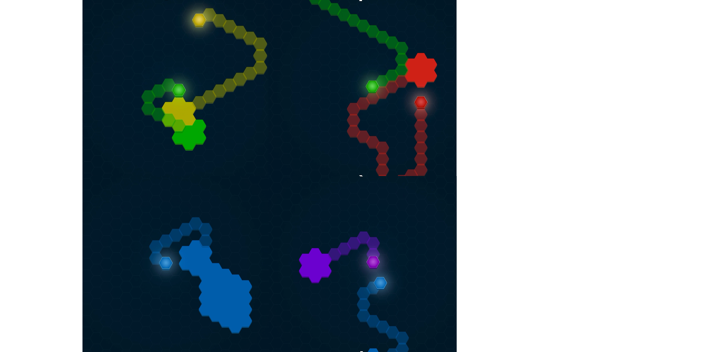

# Captured

Многопользовательская игра написанная на **C++** с использованием **SFML** для реализации клиент серверного взаимодействия

Весь процесс на сервере однопоточный за счет чего мы добились отличной синхронизации, а также мы добились отличной скорости выполнения обработки информации на сервере. На данный момент сервер может работать на любой платформе так как он довольно сильно построен на абстракциях. 
Мы написали клиент для компьютеров, чтобы показать как работает наша игра.

Смысл в том что вам надо захватывать как можно больше зон, мешая это делать другим игрокам. Убить игроков вы можете наехав на их кривую вне захваченной зоны.

Удачной игры!

## Наша Команда
* Разработчик Сервера и Клиента  
    [Евсеев Илья](https://github.com/olaoshka)
* Разработчик Графики и Интерфейса  
    [Святослав Кряжев](https://github.com/shadkain)
  

### English version

_Multiplayer game written in C ++ using SFML to implement client-server interaction_

_The whole process on the server is single-threaded due to which we have achieved excellent synchronization, as well as we have achieved excellent speed of processing information on the server. At the moment, the server can work on any platform as it is rather strongly built on abstractions._
_We wrote a client for computers to show how our game works._

_The point is that you need to capture as many zones as possible, preventing other players from doing so. You can kill players by hitting their curve outside the captured zone._

_Good game!_
